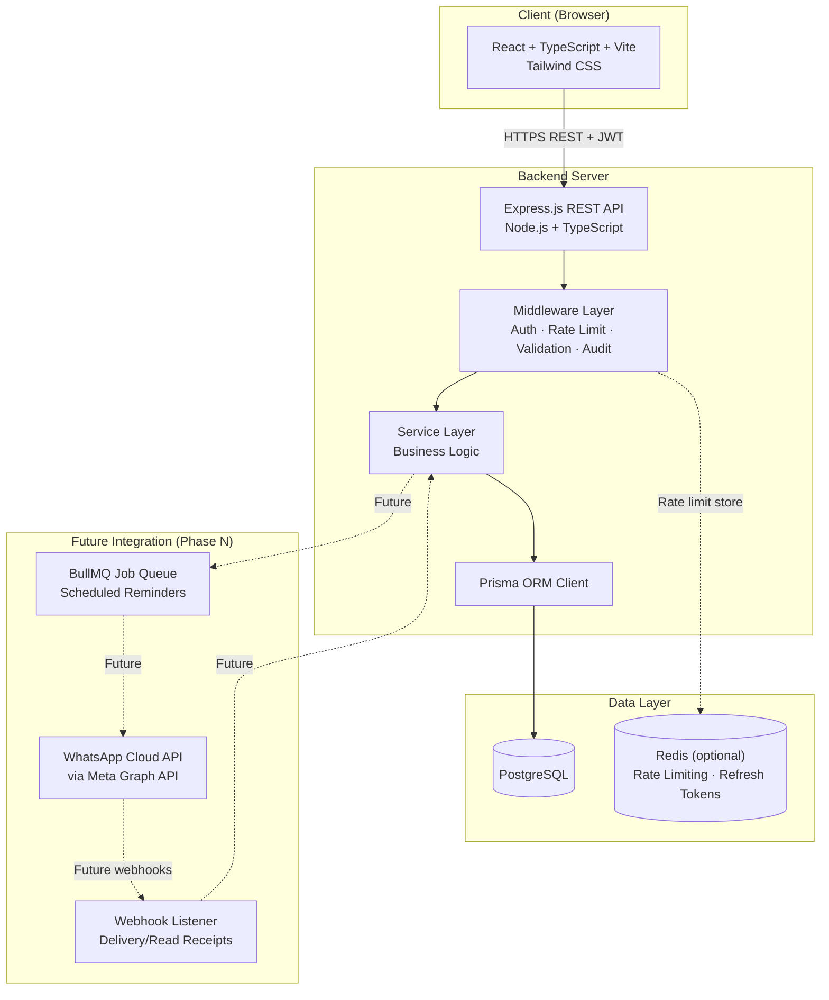
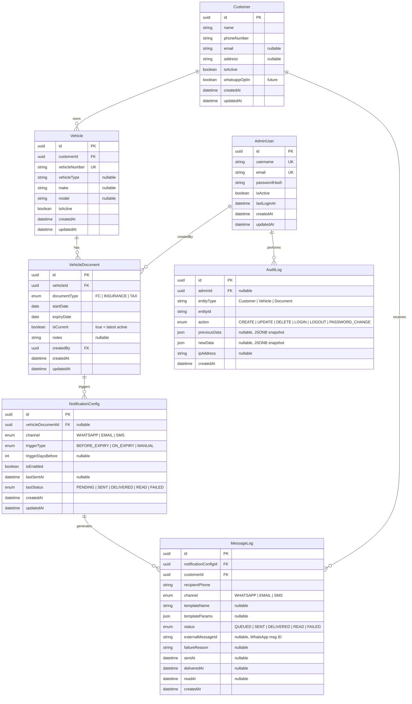
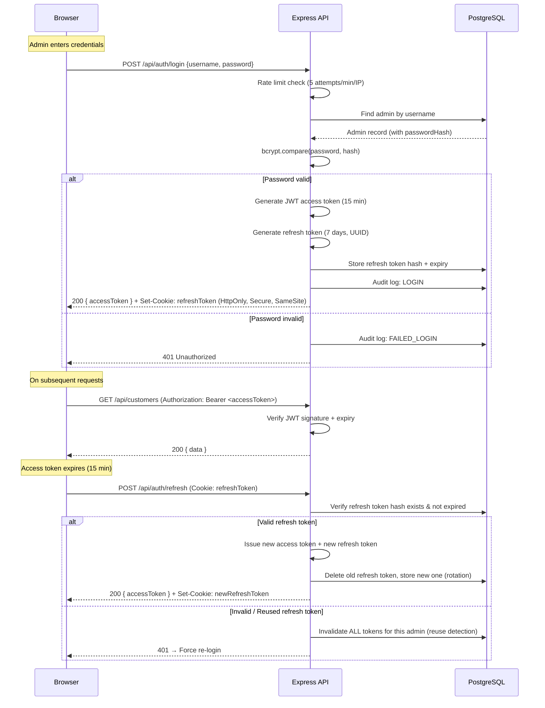
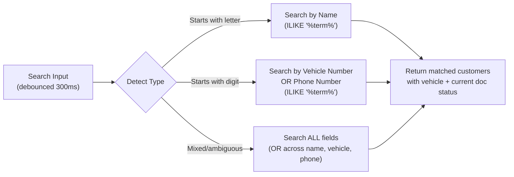
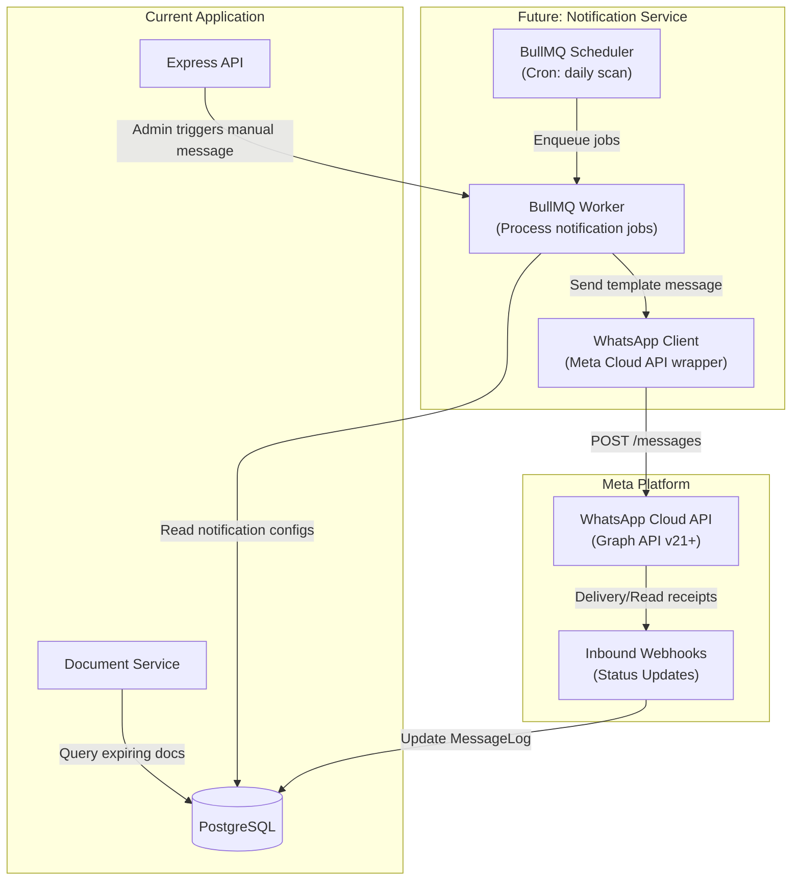
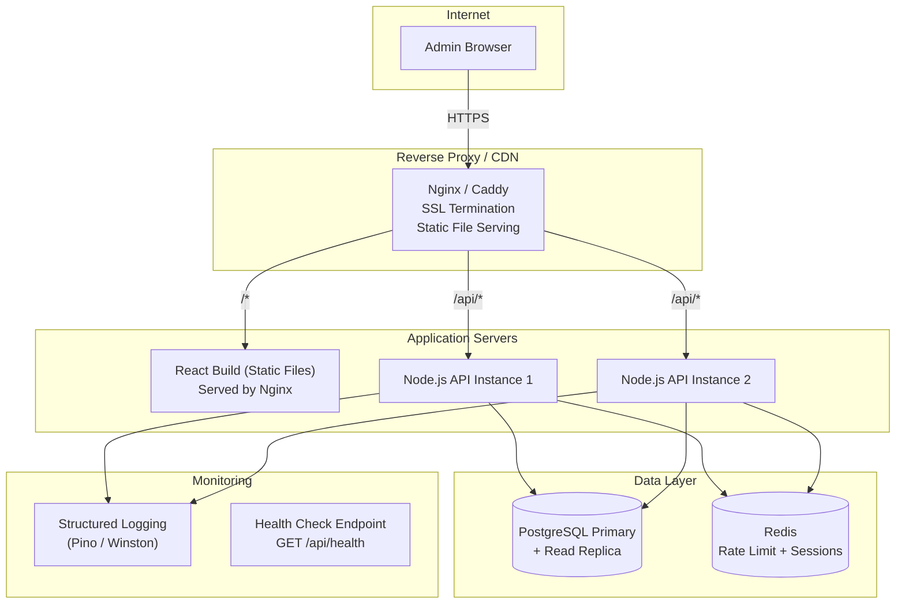

# Future Driving School — Admin Application Implementation Plan

## Overview

A production-ready admin web application for **Future Driving School** that allows authorized administrators to manage customer and vehicle document information (FC, Insurance, Tax), track document history, receive status alerts, and be ready for future WhatsApp Business Platform integration.

---

## 1. Recommended Architecture



### Layered Architecture (Backend)

| Layer | Responsibility |
|---|---|
| **Routes** | Define endpoints, attach middleware, call controllers |
| **Controllers** | Parse request, call services, format response |
| **Services** | All business logic (status calculation, search, filters) |
| **Repositories** | Prisma queries abstracted behind interfaces |
| **Middleware** | Auth guard, rate limiter, input validation (Zod), audit logger |
| **Utils** | JWT helpers, password hashing, date helpers, error classes |

### Monorepo Structure

```
future-driving-school/
├── client/                    # React + Vite frontend
│   ├── public/
│   │   └── logo.svg
│   ├── src/
│   │   ├── assets/            # Images, fonts
│   │   ├── components/        # Reusable UI components
│   │   │   ├── ui/            # Button, Input, Card, Modal, Badge, etc.
│   │   │   ├── layout/        # Header, Sidebar, PageWrapper
│   │   │   └── shared/        # StatusBadge, DocumentCard, SearchBar
│   │   ├── features/          # Feature-based modules
│   │   │   ├── auth/          # LoginPage, useAuth hook, AuthContext
│   │   │   ├── home/          # HomePage, CustomerInfoPanel, BannerSection
│   │   │   ├── dashboard/     # DashboardPage, SearchResults, FilterPanel
│   │   │   ├── history/       # DocumentHistoryModal, HistoryTimeline
│   │   │   └── settings/      # SettingsPage, ThemeToggle, ChangePassword
│   │   ├── hooks/             # Custom React hooks
│   │   ├── lib/               # API client (axios), date utils, constants
│   │   ├── context/           # AuthContext, ThemeContext
│   │   ├── types/             # TypeScript interfaces & enums
│   │   ├── styles/            # Global CSS, Tailwind config overrides
│   │   ├── App.tsx
│   │   ├── main.tsx
│   │   └── router.tsx         # React Router v7 config
│   ├── index.html
│   ├── tailwind.config.ts
│   ├── tsconfig.json
│   ├── vite.config.ts
│   └── package.json
│
├── server/                    # Node.js + Express backend
│   ├── prisma/
│   │   ├── schema.prisma
│   │   ├── migrations/
│   │   └── seed.ts            # Seed default admin user
│   ├── src/
│   │   ├── routes/            # Express route definitions
│   │   │   ├── auth.routes.ts
│   │   │   ├── customer.routes.ts
│   │   │   ├── vehicle.routes.ts
│   │   │   ├── document.routes.ts
│   │   │   └── admin.routes.ts
│   │   ├── controllers/
│   │   │   ├── auth.controller.ts
│   │   │   ├── customer.controller.ts
│   │   │   ├── vehicle.controller.ts
│   │   │   └── document.controller.ts
│   │   ├── services/
│   │   │   ├── auth.service.ts
│   │   │   ├── customer.service.ts
│   │   │   ├── vehicle.service.ts
│   │   │   ├── document.service.ts
│   │   │   ├── documentStatus.service.ts
│   │   │   └── audit.service.ts
│   │   ├── middleware/
│   │   │   ├── auth.middleware.ts       # JWT verification guard
│   │   │   ├── rateLimiter.middleware.ts # Login rate limiting
│   │   │   ├── validate.middleware.ts    # Zod schema validation
│   │   │   └── errorHandler.middleware.ts
│   │   ├── validators/         # Zod schemas per entity
│   │   │   ├── auth.schema.ts
│   │   │   ├── customer.schema.ts
│   │   │   ├── vehicle.schema.ts
│   │   │   └── document.schema.ts
│   │   ├── utils/
│   │   │   ├── jwt.ts
│   │   │   ├── password.ts    # bcrypt hash/compare
│   │   │   ├── dateHelpers.ts # Status calculation logic
│   │   │   └── errors.ts     # Custom error classes
│   │   ├── config/
│   │   │   └── env.ts         # Environment variable validation (Zod)
│   │   ├── types/
│   │   │   └── index.ts
│   │   └── app.ts             # Express app setup
│   │   └── server.ts          # Server entry point
│   ├── tsconfig.json
│   └── package.json
│
├── .env.example               # Template (no secrets)
├── .gitignore
├── docker-compose.yml         # PostgreSQL + Redis for local dev
├── README.md
└── package.json               # Workspace root (npm workspaces)
```

---

## 2. Database Schema



### Prisma Schema (Core Models)

```prisma
generator client {
  provider = "prisma-client-js"
}

datasource db {
  provider = "postgresql"
  url      = env("DATABASE_URL")
}

enum DocumentType {
  FC
  INSURANCE
  TAX
}

enum AuditAction {
  CREATE
  UPDATE
  DELETE
  LOGIN
  LOGOUT
  PASSWORD_CHANGE
}

enum NotificationChannel {
  WHATSAPP
  EMAIL
  SMS
}

enum NotificationTrigger {
  BEFORE_EXPIRY
  ON_EXPIRY
  MANUAL
}

enum MessageStatus {
  QUEUED
  SENT
  DELIVERED
  READ
  FAILED
}

model AdminUser {
  id           String    @id @default(uuid())
  username     String    @unique
  email        String    @unique
  passwordHash String    @map("password_hash")
  isActive     Boolean   @default(true) @map("is_active")
  lastLoginAt  DateTime? @map("last_login_at")
  createdAt    DateTime  @default(now()) @map("created_at")
  updatedAt    DateTime  @updatedAt @map("updated_at")

  auditLogs        AuditLog[]
  createdDocuments VehicleDocument[] @relation("CreatedByAdmin")

  @@map("admin_users")
}

model Customer {
  id           String   @id @default(uuid())
  name         String
  phoneNumber  String   @map("phone_number")
  email        String?
  address      String?
  isActive     Boolean  @default(true) @map("is_active")
  whatsappOptIn Boolean @default(false) @map("whatsapp_opt_in")
  createdAt    DateTime @default(now()) @map("created_at")
  updatedAt    DateTime @updatedAt @map("updated_at")

  vehicles    Vehicle[]
  messageLogs MessageLog[]

  @@index([name])
  @@index([phoneNumber])
  @@map("customers")
}

model Vehicle {
  id            String   @id @default(uuid())
  customerId    String   @map("customer_id")
  vehicleNumber String   @unique @map("vehicle_number")
  vehicleType   String?  @map("vehicle_type")
  make          String?
  model         String?
  isActive      Boolean  @default(true) @map("is_active")
  createdAt     DateTime @default(now()) @map("created_at")
  updatedAt     DateTime @updatedAt @map("updated_at")

  customer  Customer          @relation(fields: [customerId], references: [id], onDelete: Cascade)
  documents VehicleDocument[]

  @@index([vehicleNumber])
  @@index([customerId])
  @@map("vehicles")
}

model VehicleDocument {
  id           String       @id @default(uuid())
  vehicleId    String       @map("vehicle_id")
  documentType DocumentType @map("document_type")
  startDate    DateTime     @map("start_date") @db.Date
  expiryDate   DateTime     @map("expiry_date") @db.Date
  isCurrent    Boolean      @default(true) @map("is_current")
  notes        String?
  createdById  String       @map("created_by_id")
  createdAt    DateTime     @default(now()) @map("created_at")
  updatedAt    DateTime     @updatedAt @map("updated_at")

  vehicle             Vehicle              @relation(fields: [vehicleId], references: [id], onDelete: Cascade)
  createdBy           AdminUser            @relation("CreatedByAdmin", fields: [createdById], references: [id])
  notificationConfigs NotificationConfig[]

  @@index([vehicleId, documentType])
  @@index([expiryDate])
  @@index([isCurrent])
  @@map("vehicle_documents")
}

model AuditLog {
  id           String      @id @default(uuid())
  adminId      String?     @map("admin_id")
  entityType   String      @map("entity_type")
  entityId     String      @map("entity_id")
  action       AuditAction
  previousData Json?       @map("previous_data")
  newData      Json?       @map("new_data")
  ipAddress    String?     @map("ip_address")
  createdAt    DateTime    @default(now()) @map("created_at")

  admin AdminUser? @relation(fields: [adminId], references: [id])

  @@index([entityType, entityId])
  @@index([adminId])
  @@index([createdAt])
  @@map("audit_logs")
}

// ── Future WhatsApp Integration Tables (created now, used later) ──

model NotificationConfig {
  id                 String              @id @default(uuid())
  vehicleDocumentId  String?             @map("vehicle_document_id")
  channel            NotificationChannel @default(WHATSAPP)
  triggerType        NotificationTrigger @map("trigger_type")
  triggerDaysBefore  Int?                @map("trigger_days_before")
  isEnabled          Boolean             @default(false) @map("is_enabled")
  lastSentAt         DateTime?           @map("last_sent_at")
  lastStatus         MessageStatus?      @map("last_status")
  createdAt          DateTime            @default(now()) @map("created_at")
  updatedAt          DateTime            @updatedAt @map("updated_at")

  vehicleDocument VehicleDocument? @relation(fields: [vehicleDocumentId], references: [id])
  messageLogs     MessageLog[]

  @@map("notification_configs")
}

model MessageLog {
  id                   String         @id @default(uuid())
  notificationConfigId String         @map("notification_config_id")
  customerId           String         @map("customer_id")
  recipientPhone       String         @map("recipient_phone")
  channel              NotificationChannel
  templateName         String?        @map("template_name")
  templateParams       Json?          @map("template_params")
  status               MessageStatus  @default(QUEUED)
  externalMessageId    String?        @map("external_message_id")
  failureReason        String?        @map("failure_reason")
  sentAt               DateTime?      @map("sent_at")
  deliveredAt          DateTime?      @map("delivered_at")
  readAt               DateTime?      @map("read_at")
  createdAt            DateTime       @default(now()) @map("created_at")

  notificationConfig NotificationConfig @relation(fields: [notificationConfigId], references: [id])
  customer           Customer           @relation(fields: [customerId], references: [id])

  @@index([customerId])
  @@index([status])
  @@index([createdAt])
  @@map("message_logs")
}
```

> [!NOTE]
> `NotificationConfig` and `MessageLog` tables are designed now but **will not be used** until the WhatsApp integration phase. They exist in the schema so that no schema-breaking migrations are needed later.

---

## 3. API Endpoint Plan

### Authentication

| Method | Endpoint | Description | Auth | Rate Limited |
|---|---|---|---|---|
| `POST` | `/api/auth/login` | Admin login → returns access + refresh tokens | ✗ | ✓ (5/min/IP) |
| `POST` | `/api/auth/refresh` | Refresh access token | ✗ (cookie) | ✓ |
| `POST` | `/api/auth/logout` | Invalidate refresh token, clear cookie | ✓ | ✗ |
| `PUT` | `/api/auth/change-password` | Change admin password | ✓ | ✓ (3/min) |

### Customers

| Method | Endpoint | Description | Auth |
|---|---|---|---|
| `GET` | `/api/customers` | List all customers (paginated, with current docs) | ✓ |
| `GET` | `/api/customers/:id` | Get single customer with vehicle & current docs | ✓ |
| `POST` | `/api/customers` | Create customer | ✓ |
| `PUT` | `/api/customers/:id` | Update customer | ✓ |
| `DELETE` | `/api/customers/:id` | Soft-delete customer | ✓ |

### Vehicles

| Method | Endpoint | Description | Auth |
|---|---|---|---|
| `GET` | `/api/vehicles` | List vehicles (with current docs & status) | ✓ |
| `GET` | `/api/vehicles/:id` | Get vehicle detail | ✓ |
| `POST` | `/api/vehicles` | Create vehicle for a customer | ✓ |
| `PUT` | `/api/vehicles/:id` | Update vehicle | ✓ |

### Documents

| Method | Endpoint | Description | Auth |
|---|---|---|---|
| `GET` | `/api/vehicles/:vehicleId/documents` | Get all docs for a vehicle (history) | ✓ |
| `GET` | `/api/vehicles/:vehicleId/documents/current` | Get current FC, Insurance, Tax with status | ✓ |
| `POST` | `/api/vehicles/:vehicleId/documents` | Add new doc (marks previous as `isCurrent=false`) | ✓ |
| `GET` | `/api/vehicles/:vehicleId/documents/history?type=FC` | Get history for specific doc type | ✓ |

### Search & Filter

| Method | Endpoint | Description | Auth |
|---|---|---|---|
| `GET` | `/api/search?q=term` | Search by name, vehicle number, or phone | ✓ |
| `GET` | `/api/dashboard/filter` | Filter by doc type, status, date range | ✓ |

**Filter Query Parameters:**
```
GET /api/dashboard/filter?
  documentType=FC|INSURANCE|TAX
  &status=ACTIVE|EXPIRING_SOON|EXPIRES_TODAY|EXPIRED
  &dateFrom=2026-01-01
  &dateTo=2026-12-31
  &page=1
  &limit=20
```

### Admin / Settings

| Method | Endpoint | Description | Auth |
|---|---|---|---|
| `GET` | `/api/admin/me` | Get current admin profile | ✓ |
| `GET` | `/api/admin/audit-logs` | Get audit log entries (paginated) | ✓ |

---

## 4. Frontend Page / Component Structure

### Pages & Routing

| Route | Page | Layout |
|---|---|---|
| `/login` | `LoginPage` | Standalone (no sidebar) |
| `/` | `HomePage` | Authenticated layout with sidebar |
| `/dashboard` | `DashboardPage` | Authenticated layout with sidebar |
| `/settings` | `SettingsPage` | Authenticated layout with sidebar |

### Component Hierarchy

```
App
├── AuthProvider (context)
├── ThemeProvider (context)
└── Router
    ├── /login → LoginPage
    │   ├── LoginForm
    │   └── BrandLogo
    │
    └── ProtectedRoute (auth guard)
        └── AuthenticatedLayout
            ├── Sidebar
            │   ├── Logo
            │   ├── NavLinks (Home, Dashboard, Settings)
            │   └── LogoutButton
            ├── Header
            │   ├── PageTitle
            │   ├── BrandLogo (top-right)
            │   └── AdminAvatar
            │
            ├── / → HomePage
            │   ├── HeroBanner (large banner image)
            │   ├── CustomerOverviewSection
            │   │   ├── CustomerInfoGrid
            │   │   │   └── CustomerCard (×n)
            │   │   │       ├── CustomerDetails (name, phone, vehicle)
            │   │   │       ├── DocumentStatusRow (FC)
            │   │   │       │   └── StatusBadge
            │   │   │       ├── DocumentStatusRow (Insurance)
            │   │   │       │   └── StatusBadge
            │   │   │       └── DocumentStatusRow (Tax)
            │   │   │           └── StatusBadge
            │   │   └── Pagination
            │   └── SelectedCustomerPanel (when navigated from Dashboard)
            │       ├── CustomerFullDetails
            │       ├── DocumentCards (FC, Insurance, Tax)
            │       │   └── StatusBadge + dates
            │       └── ViewHistoryButton → DocumentHistoryModal
            │
            ├── /dashboard → DashboardPage
            │   ├── SearchBar (unified search: name / vehicle / phone)
            │   ├── FilterPanel
            │   │   ├── DocumentTypeFilter (FC, Insurance, Tax)
            │   │   ├── StatusFilter (Active, Expiring Soon, Expires Today, Expired)
            │   │   ├── DateRangeFilter
            │   │   ├── ApplyButton
            │   │   └── ClearButton
            │   ├── SearchResults / FilterResults
            │   │   └── CustomerResultCard (×n) → click → navigate to Home
            │   └── Pagination
            │
            ├── /settings → SettingsPage
            │   ├── ThemeToggle (Light / Dark)
            │   ├── ChangePasswordForm
            │   ├── LogoutButton
            │   └── FutureSettingsPlaceholder
            │
            └── Shared Modals
                └── DocumentHistoryModal
                    ├── HistoryTimeline
                    │   └── HistoryEntry (×n)
                    │       ├── DocumentType badge
                    │       ├── Start date → Expiry date
                    │       └── Created/Updated metadata
                    └── CloseButton
```

### Reusable UI Components

| Component | Purpose |
|---|---|
| `Button` | Primary, secondary, danger, ghost variants |
| `Input` | Text, password, date inputs with validation state |
| `Card` | Container with shadow, border, hover effects |
| `Badge` / `StatusBadge` | Color-coded status indicators |
| `Modal` | Overlay dialog for history, confirmations |
| `Table` | Sortable data tables |
| `SearchBar` | Debounced search with icon |
| `FilterChip` | Toggleable filter tags |
| `Pagination` | Page navigation |
| `Toast` | Success/error notifications |
| `Skeleton` | Loading placeholders |
| `EmptyState` | "No results" illustrations |

---

## 5. Authentication Design

### Flow



### Security Specifications

| Aspect | Implementation |
|---|---|
| **Password hashing** | `bcrypt` with salt rounds = 12 |
| **Access token** | JWT, HS256, 15-minute expiry, stored in memory (React state) |
| **Refresh token** | Random UUID, 7-day expiry, stored in `HttpOnly` + `Secure` + `SameSite=Strict` cookie |
| **Refresh token storage** | SHA-256 hash stored in DB (never store raw) |
| **Token rotation** | New refresh token on every refresh; old one invalidated |
| **Reuse detection** | If a previously-used refresh token is presented → revoke all sessions |
| **Rate limiting** | `express-rate-limit`: login = 5 req/min/IP, password change = 3 req/min |
| **Input validation** | All inputs validated with Zod schemas before processing |
| **CORS** | Whitelist only the frontend origin |
| **Helmet** | HTTP security headers via `helmet` middleware |

### Seed Admin

A seed script (`prisma/seed.ts`) creates the initial admin user:
```typescript
// password provided via CLI prompt or env var, never hardcoded
await prisma.adminUser.create({
  data: {
    username: 'admin',
    email: 'admin@futuredrivingschool.com',
    passwordHash: await bcrypt.hash(process.env.ADMIN_SEED_PASSWORD!, 12),
  },
});
```

---

## 6. Document Status Calculation Logic

### Status Definitions

```typescript
enum DocumentStatus {
  ACTIVE = 'ACTIVE',           // expiryDate > today + 30 days
  EXPIRING_SOON = 'EXPIRING_SOON', // expiryDate is within 30 days from today
  EXPIRES_TODAY = 'EXPIRES_TODAY',  // expiryDate === today
  EXPIRED = 'EXPIRED',         // expiryDate < today
}
```

### Calculation Algorithm

```typescript
// server/src/utils/dateHelpers.ts

import { differenceInDays, isToday, isBefore, startOfDay } from 'date-fns';

const EXPIRING_SOON_THRESHOLD_DAYS = 30;

export function calculateDocumentStatus(expiryDate: Date): DocumentStatus {
  const today = startOfDay(new Date());
  const expiry = startOfDay(new Date(expiryDate));

  if (isToday(expiry)) {
    return DocumentStatus.EXPIRES_TODAY;
  }

  if (isBefore(expiry, today)) {
    return DocumentStatus.EXPIRED;
  }

  const daysRemaining = differenceInDays(expiry, today);

  if (daysRemaining <= EXPIRING_SOON_THRESHOLD_DAYS) {
    return DocumentStatus.EXPIRING_SOON;
  }

  return DocumentStatus.ACTIVE;
}

export function getDaysRemaining(expiryDate: Date): number {
  const today = startOfDay(new Date());
  const expiry = startOfDay(new Date(expiryDate));
  return differenceInDays(expiry, today);
}
```

### Status Badge Mapping (Frontend)

| Status | Color | Icon | Label |
|---|---|---|---|
| `ACTIVE` | 🟢 Green | ✓ | "Active — X days remaining" |
| `EXPIRING_SOON` | 🟠 Amber | ⚠ | "Expiring Soon — X days left" |
| `EXPIRES_TODAY` | 🔴 Red pulse | ⏰ | "Expires Today!" |
| `EXPIRED` | 🔴 Red | ✗ | "Expired X days ago" |

> [!IMPORTANT]
> Status is **always calculated server-side** at request time using the current date. It is never stored in the database, ensuring it's always accurate. The frontend receives the pre-computed status in API responses.

### API Response Shape

```typescript
interface CustomerWithDocuments {
  id: string;
  name: string;
  phoneNumber: string;
  vehicles: {
    id: string;
    vehicleNumber: string;
    currentDocuments: {
      fc: DocumentWithStatus | null;
      insurance: DocumentWithStatus | null;
      tax: DocumentWithStatus | null;
    };
  }[];
}

interface DocumentWithStatus {
  id: string;
  documentType: 'FC' | 'INSURANCE' | 'TAX';
  startDate: string;     // ISO date
  expiryDate: string;    // ISO date
  status: DocumentStatus;
  daysRemaining: number; // negative if expired
}
```

---

## 7. Search & Filter Design

### Unified Search



**Implementation:** A single SQL query using Prisma's `OR` with `contains` (case-insensitive via `mode: 'insensitive'`):

```typescript
// server/src/services/customer.service.ts

async searchCustomers(query: string, page: number, limit: number) {
  return prisma.customer.findMany({
    where: {
      OR: [
        { name: { contains: query, mode: 'insensitive' } },
        { phoneNumber: { contains: query, mode: 'insensitive' } },
        {
          vehicles: {
            some: {
              vehicleNumber: { contains: query, mode: 'insensitive' },
            },
          },
        },
      ],
      isActive: true,
    },
    include: {
      vehicles: {
        include: {
          documents: { where: { isCurrent: true } },
        },
      },
    },
    skip: (page - 1) * limit,
    take: limit,
    orderBy: { name: 'asc' },
  });
}
```

### Dashboard Filters

```typescript
interface FilterParams {
  documentType?: 'FC' | 'INSURANCE' | 'TAX';
  status?: 'ACTIVE' | 'EXPIRING_SOON' | 'EXPIRES_TODAY' | 'EXPIRED';
  dateFrom?: string; // ISO date — filter on expiryDate >= dateFrom
  dateTo?: string;   // ISO date — filter on expiryDate <= dateTo
  page?: number;
  limit?: number;
}
```

**Filter Logic:**
1. Query `VehicleDocument` where `isCurrent = true`
2. Apply `documentType` filter if provided
3. Apply date range filter on `expiryDate` if provided
4. Compute status for each result using `calculateDocumentStatus()`
5. Filter by `status` **after** computation (since status is derived, not stored)
6. Join back to `Vehicle` → `Customer` to return full customer cards

> [!NOTE]
> Since `status` is computed at runtime, the status filter is applied **post-query** in the service layer. For large datasets, a materialized view or scheduled status column update could be introduced later.

---

## 8. Future WhatsApp Integration Architecture

> [!IMPORTANT]
> This section describes the **architecture design only**. No WhatsApp code will be implemented in the current phases.

### Architecture



### Design Decisions for Future-Proofing

| Decision | Rationale |
|---|---|
| **`NotificationConfig` table** exists now | Allows admins to pre-configure which documents trigger reminders, even before WhatsApp is connected |
| **`MessageLog` table** exists now | Ready to track every message sent, with status lifecycle (Queued → Sent → Delivered → Read / Failed) |
| **`whatsappOptIn` on Customer** | WhatsApp Business API requires opt-in consent — the field is ready |
| **`channel` enum includes EMAIL, SMS** | The notification system is channel-agnostic; WhatsApp is the first channel but not the only one |
| **Service layer abstraction** | The `DocumentStatusService` that calculates expiry status will also be used by the notification scheduler to find documents needing reminders |
| **BullMQ as job queue** | Recommended for Node.js; runs a daily cron to scan for upcoming expiries and enqueue notification jobs |
| **Webhook endpoint stub** | A route `/api/webhooks/whatsapp` will be created (but not implemented) for Meta to POST delivery/read receipts |

### Future Implementation Phases (WhatsApp)

```
Phase N+1: WhatsApp Foundation
  → Register WhatsApp Business Account with Meta
  → Configure phone number, business profile
  → Create message templates (approved by Meta)
  → Implement WhatsApp Cloud API client wrapper
  → Implement webhook listener for status updates

Phase N+2: Automated Reminders
  → BullMQ daily cron job: scan VehicleDocuments expiring within threshold
  → Match against NotificationConfig rules
  → Enqueue send jobs → Worker sends via Cloud API
  → Update MessageLog with delivery status

Phase N+3: Admin Manual Messages
  → UI button: "Send reminder" on customer detail
  → API endpoint triggers immediate notification job
  → Admin can see message history and delivery status
```

---

## 9. Development Phases

### Phase 1: Project Setup & Infrastructure
- Initialize monorepo with npm workspaces
- Set up Vite + React + TypeScript + Tailwind for `client/`
- Set up Express + TypeScript for `server/`
- Configure PostgreSQL with Docker Compose
- Set up Prisma schema, run initial migration
- Configure ESLint, Prettier, `.env` handling
- Seed default admin user

### Phase 2: Authentication System
- Implement bcrypt password hashing utilities
- Implement JWT access + refresh token utilities
- Build `/api/auth/login`, `/refresh`, `/logout`, `/change-password` endpoints
- Add rate limiting middleware for login
- Build `LoginPage` with form validation
- Build `AuthContext` + `ProtectedRoute` component
- Implement token refresh interceptor in axios client
- Add audit logging for auth events

### Phase 3: Core Data Management (Backend)
- Implement Customer CRUD service + controller + routes
- Implement Vehicle CRUD service + controller + routes
- Implement Document creation with history preservation logic
- Implement `documentStatus.service.ts` (status calculation)
- Add Zod validation schemas for all inputs
- Add audit logging for data mutations
- Write API tests

### Phase 4: Home Page (Frontend)
- Design and build `AuthenticatedLayout` (sidebar + header)
- Generate and integrate Future Driving School logo and banner
- Build `CustomerCard` component with document status badges
- Build `CustomerOverviewSection` with paginated grid
- Build `SelectedCustomerPanel` for detailed view
- Implement `StatusBadge` with color-coded indicators
- Connect to backend APIs

### Phase 5: Dashboard (Search & Filter)
- Build `SearchBar` with debounced input
- Implement search API integration
- Build `FilterPanel` with document type, status, date range filters
- Build `SearchResults` / `FilterResults` list
- Implement "click result → navigate to Home with customer selected" flow
- Add pagination

### Phase 6: Document History
- Build `DocumentHistoryModal` component
- Build `HistoryTimeline` showing past FC/Insurance/Tax records
- Implement history API integration
- Display created/updated metadata per record

### Phase 7: Settings & Polish
- Build `SettingsPage` layout
- Implement Light/Dark mode toggle with `ThemeContext` + Tailwind dark mode
- Build `ChangePasswordForm` with current/new/confirm validation
- Add logout from Settings
- Design extensible settings structure for future additions
- Responsive design audit
- Loading states, error states, empty states
- Micro-animations and transitions
- Final UI polish

### Phase 8: Security Hardening & Production Prep
- Security audit: CORS, Helmet, input sanitization
- Error handling review
- Performance optimization (query optimization, pagination)
- Environment variable documentation
- Create production Dockerfile(s)
- CI/CD pipeline configuration
- README with setup instructions

---

## 10. Production Deployment Architecture



### Deployment Options

| Option | Best For | Notes |
|---|---|---|
| **VPS (DigitalOcean / Hetzner)** | Cost-effective, full control | Docker Compose with Nginx, PostgreSQL, Redis |
| **Railway / Render** | Quick deploy, managed infra | Built-in PostgreSQL, auto-deploy from Git |
| **AWS (EC2 + RDS + ElastiCache)** | Enterprise-grade, scalable | More complex, higher cost, best for growth |

### Production Checklist

- [ ] Environment variables via `.env` (never committed)
- [ ] PostgreSQL connection pooling (PgBouncer or Prisma pool)
- [ ] SSL certificates (Let's Encrypt via Certbot)
- [ ] Automated database backups (daily)
- [ ] Structured JSON logging (Pino)
- [ ] Health check endpoint (`GET /api/health`)
- [ ] Graceful shutdown handling
- [ ] PM2 or Docker for process management
- [ ] CORS restricted to production domain
- [ ] Rate limiting backed by Redis
- [ ] Database migrations run as part of deploy pipeline

---

## Open Questions

> [!IMPORTANT]
> **Q1: "Expiring Soon" threshold** — I've defaulted to **30 days**. Would you prefer a different number of days (e.g., 15 days, 45 days)?

> [!IMPORTANT]
> **Q2: Multi-admin support** — Should the application support multiple admin users from the start, or is a single admin sufficient for now?

> [!IMPORTANT]
> **Q3: Customer creation** — Should admins be able to create/edit/delete customers and vehicles through this app, or is it read-only with data imported from elsewhere?

> [!IMPORTANT]
> **Q4: Deployment target** — Do you have a preferred hosting platform (VPS, Railway, AWS, etc.), or should I keep it platform-agnostic?

> [!IMPORTANT]
> **Q5: Logo & Banner** — Do you have a Future Driving School logo and banner image, or should I generate them?

> [!IMPORTANT]
> **Q6: Tailwind CSS version** — You specified Tailwind CSS. Should I use **Tailwind CSS v4** (latest) or **v3** (stable/mature)?
